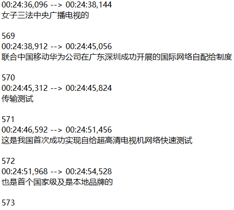
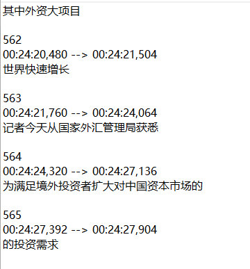

# Autosub-with-Baidu-DeepSpeech2
autosub是目前比较好的语音识别的工具，但是它的问题是，由于受到qiang的限制，我们需要找到合适的vpn才能使用这个开源的工具。针对中文语音的识别，我们结合了百度的deepspeech模型，结合使用autosub和百度的模型来进行识别，这样就很好的解决了上述问题，本项目将这种技术运用在了新闻联播节目的语音识别，来为新闻联播节目加上字幕，取得了一定的效果，因为是直接用了百度训练好的baidu_cn1.2k模型，所以效果并没有特别好，有需要的小伙伴可以自己训练适合于特定项目的模型。

# 环境需求及安装配置
操作系统：ubuntu16.04
python环境：使用python2.7

环境配置：
	sudo apt-get install -y pkg-config libflac-dev libogg-dev libvorbis-dev libboost-dev swig

    'google-api-python-client>=1.4.2',
    'requests>=2.3.0',
    'pysrt>=1.0.1',
    'progressbar2>=3.34.3',
    'six>=1.11.0',
	'progressbar',
	'scipy>=0.19.0',
	'paddlepaddle'->pip install paddlepaddle-gpu==1.1.0.post87,
	运行 sh setup.sh
	
# 数据及模型下载
测试数据下载：链接：https://pan.baidu.com/s/1xr4YXN3g30fx2pQEKrgx1Q 
提取码：r09s 将数据下载到/data/cctv/路径下
下载好数据后，我已将该视频生成的srt文件放在了/data/cctv/目录下，打开视频添加srt文件即可看到测试视频的效果。

训练好的中文模型baidu_cn1.2k下载地址：
链接：https://pan.baidu.com/s/1JI1Qh4x9UT9fdkT6TBYp0Q 
提取码：t29d
将模型下载到models/baidu_cn1.2k路径下解压

# 代码运行
运行代码：调用接口task1_interface.py：
from task1_interface import extractSubtitlefromVideo(./data/cctv/CCTV.mp4)

# 识别结果
  
  
  

# 注：
1）配置环境需要cuda8.0+cudnn7，建议使用conda install cudnn=7.0.5进行安装
2）若出现带有interpn.so类似字样的错误，建议使用pip卸载resampy，再重新进行安装，并将scipy升级至0.19.0以上
3）大概要使用6GB左右的GPU内存空间

